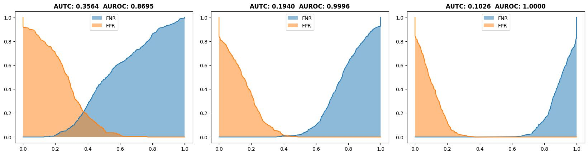
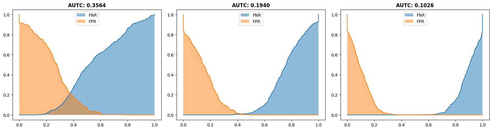

# Overview
According to the paper [Beyond AUROC & co. for evaluating
out-of-distribution detection performance](https://arxiv.org/abs/2306.14658), AUROC has some limitation for indicating the model's ability.   
Author thus proposed a new metric called "area under threshold curve (AUTC)".  
The smaller the AUTC is, the strong ability for detecting OOD sample the model has.

# Demo
I have implement 3 version of AUTC (numpy, torch, tensorflow).
- Numpy

- Torch

- Tensorflow

# Example
[main_numpy.ipynb](main_numpy.ipynb)  
[main_tf.ipynb](main_tf.ipynb)  
[main_torch.ipynb](main_torch.ipynb)  

# Note
I test pytorch 2.0, I found torch.histogram cannot run on gpu, so torch version of autc only support cpu tensor so far.
